# Gawè Yogyakarta

## 📌 Nama Produk
**Gawè Yogyakarta** – Aplikasi eksplorasi event lokal berbasis peta dan kalender untuk wilayah Yogyakarta dan Sleman.

## 📝 Deskripsi Produk
Gawè Yogyakarta adalah aplikasi mobile berbasis React Native yang membantu masyarakat dan wisatawan menemukan serta menjelajahi berbagai acara di Yogyakarta. Aplikasi ini mengintegrasikan peta interaktif, kalender event, dan kategori warna untuk memudahkan pencarian acara sesuai minat. Setiap detail visual dirancang minimalis namun tetap mencerminkan identitas budaya lokal.

## 🧩 Komponen Pembangun Produk

### Frontend
- React Native + Expo Router
- TypeScript
- React Navigation 
- React Native Maps
- WebView
- UI/UX Components

### Backend
- Firebase Realtime Database

### Desain
- Color Palette
- Fonts Awesome 5 & Material Icons

### Peta
- React Native Maps
- WebView

### Tool Pendukung
- Git + GitHub  
- Expo CLI
- VS Code

## 📚 Sumber Data
- [Visiting Jogja – Calendar of Event 2025](https://visitingjogja.jogjaprov.go.id/event-agenda-pariwisata-jogja/)
- Google Maps API (koordinat lokasi event)  

## 📸 Tangkapan Layar Komponen Penting Produk

<h3>Get Started Page</h3>
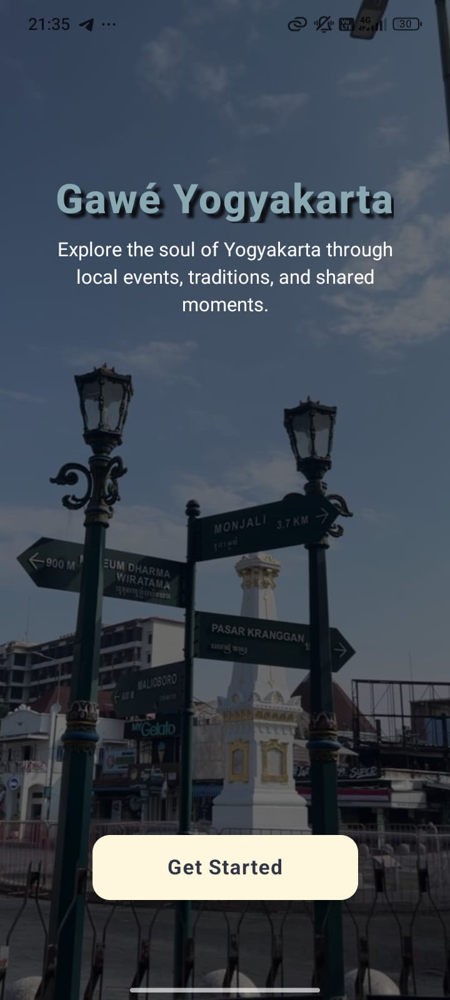

<h3>Register & Login Page</h3>

  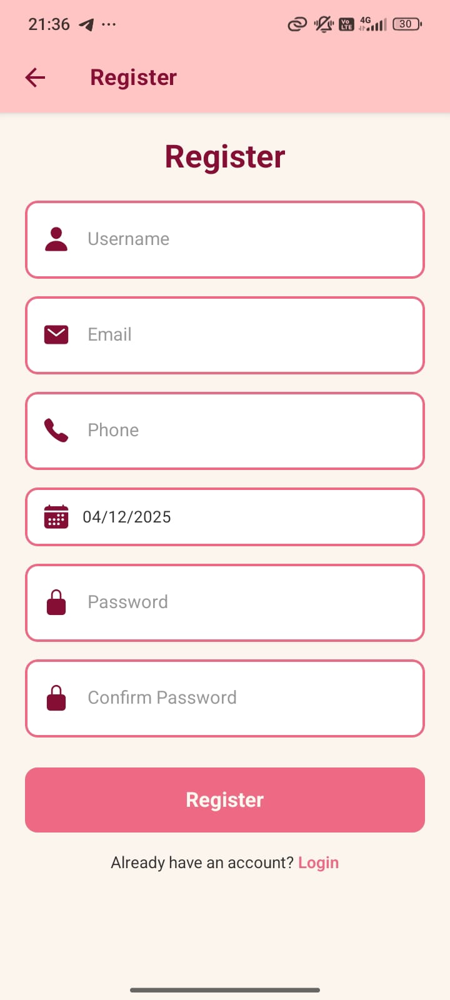
  

<h3>Home Page</h3>

<h3>Schedule Page</h3>
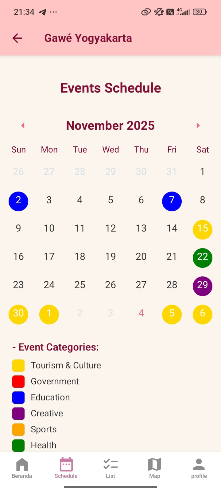

<h3>List Page</h3>
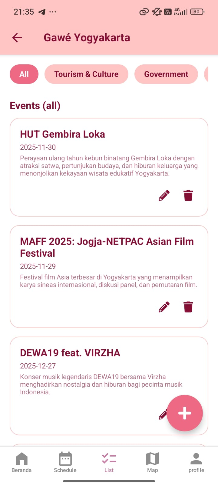

<h3>Map Page</h3>

  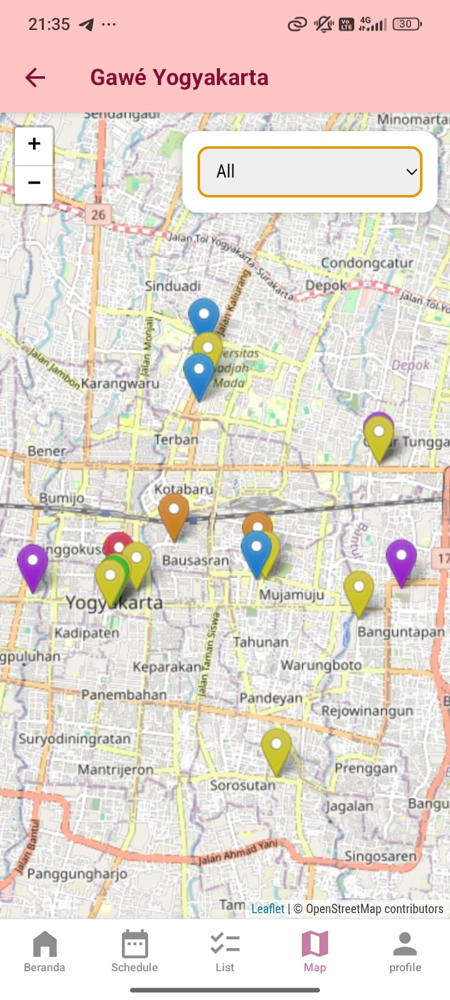
  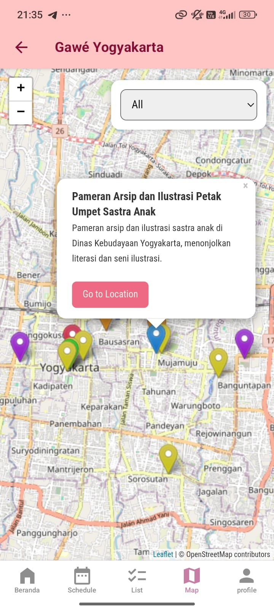
  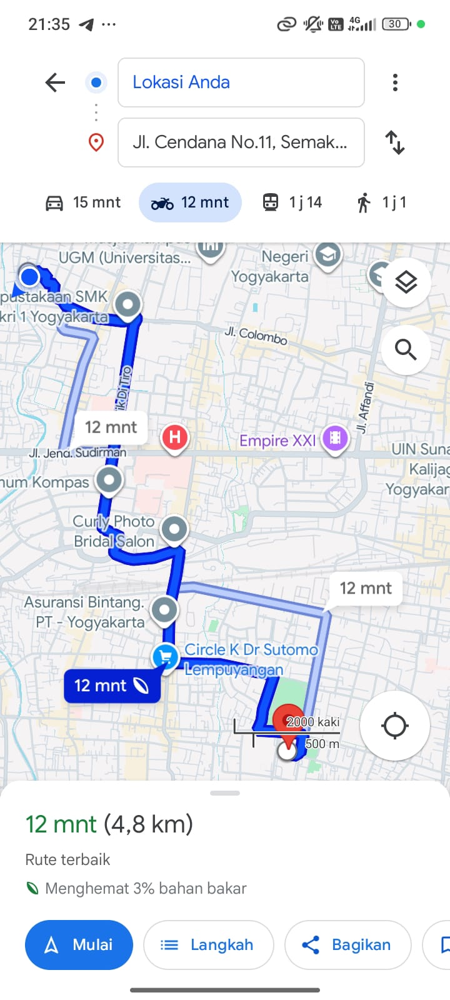

<h3>Event Detail Page</h3>
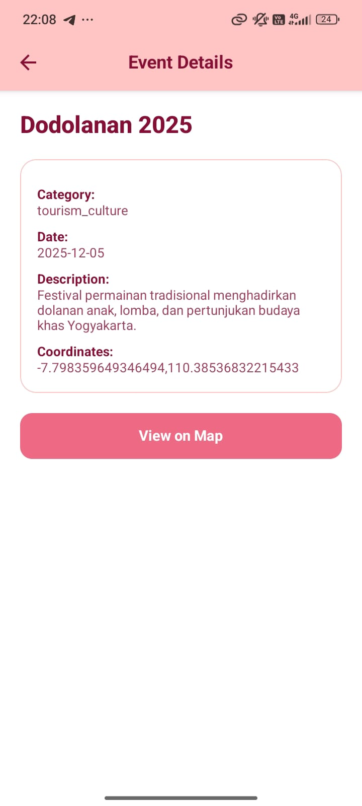

<h3>Form Input & Edit</h3>

  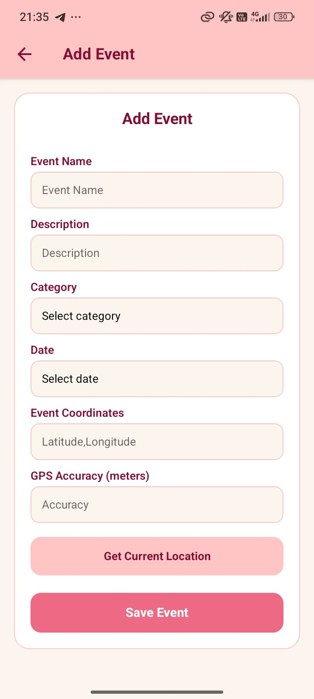
  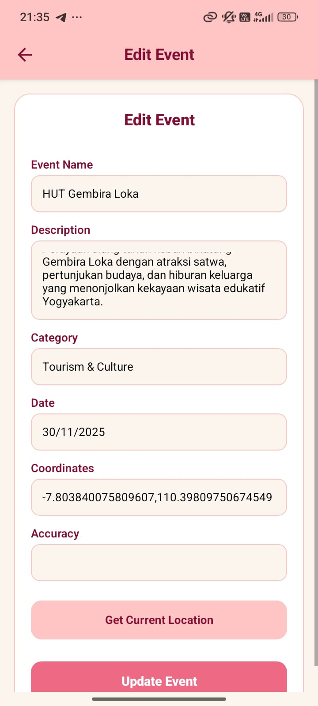

<h3>Profile Page</h3>
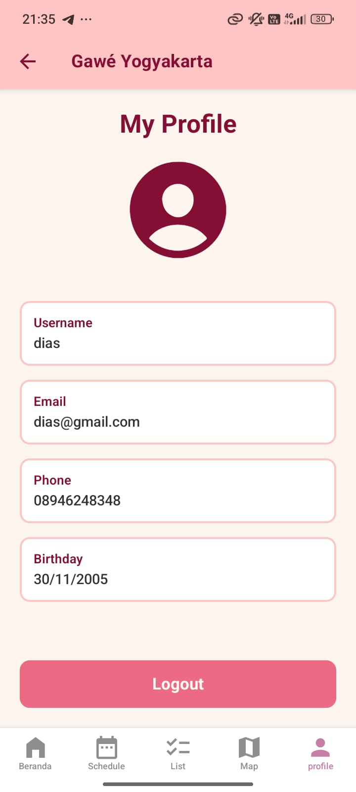
